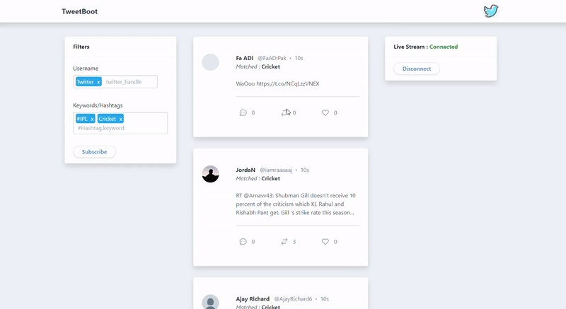

# TweetBoot

[](https://travis-ci.com/Kiran1901/tweetboot)

Java 8 is needed to run this application.

No third-party library is used for fetching or streaming tweets from Twitter API.

### Features
- Shows Trending tweets with pagination on main page
- Subscribe to the live tweets from twitter with twitter handle, keywords and hashtags
- Up to 25 filter keywords and twitter handles can be used to stream tweets
- Stream can be stopped or connected again whenever required

### Sources
- The Twitter like UI is used from [codepen](https://codepen.io/mithicher/pen/JjdgYdy) by [Mithicher Baro](https://mithicher.dev/) with some modifications.
- [Twitter API v2](https://developer.twitter.com/en/docs/twitter-api/early-access)

### Preview


---
### *Note*
Twitter only allows one Filtered Stream from one developer account with bearer token authentication. Find more info [here](). Also there is monthly [limit](https://developer.twitter.com/en/docs/twitter-api/rate-limits) on tweets can be pulled from API.

---
### Clone
```
git clone https://github.com/Kiran1901/tweetboot.git
```
### Twitter API access credentials
You must have developer account to access Twitter API. If you don't have account apply for it [here](https://developer.twitter.com/en/apply-for-access). Find [more info](https://developer.twitter.com/en/docs/authentication/overview) about authentication and credentials and [limits](https://developer.twitter.com/en/docs/twitter-api/rate-limits). For generation of bearer token follow [this](https://developer.twitter.com/en/docs/authentication/oauth-2-0).

Two ways for configuring Twitter API credentials

Enter credentials directly in the file `src\main\resources\application.yml` without any quotes.
```yml
tweeter:  
  api:  
    api-key: <Enter your api key here without quotes>  
    api-secret-key: <Enter your api secret key here without quotes>  
    bearer-string: Bearer <Enter your bearer token here without quotes>  
    bearer-token: <Enter your bearer token here without quotes>
```

Alternatively, set API credentials in environment variables in your OS. If the file `src\main\resources\application.yml` looks like following then set TWITTER_API_KEY, TWITTER_API_SECRET_KEY, TWITTER_BEARER_TOKEN with respective values in environment. This is more secure and preferred way.
```yml
tweeter:  
  api:  
    api-key: ${TWITTER_API_KEY}
    api-secret-key: ${TWITTER_API_SECRET_KEY}
    bearer-string: Bearer ${TWITTER_BEARER_TOKEN}
    bearer-token: ${TWITTER_BEARER_TOKEN}
```

### Testing
Application tests are located in the package `src\test\java\com\kiran\tweetboot`

- Run tests easily with IDE ( For [Intellij](https://stackoverflow.com/a/28443830/9004116) and [Eclipse](https://www.toolsqa.com/java/junit-framework/running-junit-tests-eclipse/) )

### Run
There are several ways to run a Spring Boot application on your local machine. One way is to execute the `main` method in the `src\main\java\com\kiran\tweetboot\TweetbootApplication.java` class from your IDE

Run Spring Boot App with Gradle
```
gradle bootRun
```

### Deploy on Heroku
Follow the instructions from official documentation [here](https://devcenter.heroku.com/articles/getting-started-with-gradle-on-heroku#set-up).
